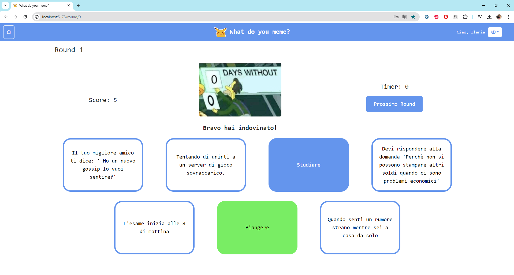
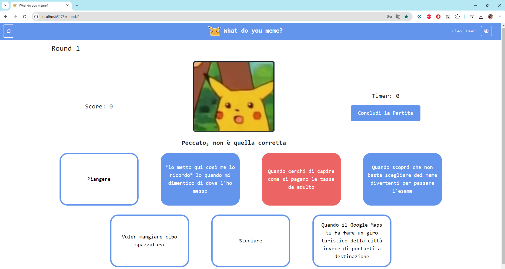

# Exam #1: "Gioco dei meme"
## Student: s314678 PASINI ILARIA

## React Client Application Routes
      
- Route `/`: pagine iniziame di home che spiega il gioco e permette di iniziarlo o di loggarsi
- Route `/round/:round`: pagina che permette l'effettivo gioco, cioè è un singolo round definito da :round
- Route `/sumGame` : pagina che mostra il riassunto della partita a solo gli utenti loggati
- Route `/user/:id/match` : pagina che mostra tutte le partite giocate da un preciso giocatore
- Route `/user/:id/match/:id_match` : pagina che mostra il round e per cui le componenti di una partita`
- Route `/login` : pagina che permette di inserire i cambi di login
- Route `*` : pagina not found


## API Server
Di seguito tutte le spiegazioni delle API HTTP implementate nel progetto


### ___Get tutti i Meme___
- GET `/api/memes`
  - e' stata implementata ma non usata
  - permette di ottere tutti i meme 
  - Request parameters: nessuno
  - Response body: 
  ```
  [
        { ID: 1, Image: './letMeIn.png' }
       
        { ID: 10, Image: './cricetino.jpg' }
  ]
  ```
Risposta: `200 OK` (successo) or `500 Internal Server Error`(errore generico).

### ___Get un solo Meme___
- GET `/api/memes/<id>`
  - viene utilizzato CORS per elementi statici, ma è stato implementato come se si facessero delle richieste vere e proprie in modo generico, in modo che fosse usabile sempre
  - permette di ottere uno specifico meme in base al suo id
  - Request parameters: id del meme
  - Response body: 
  ``` 
  [
        { ID: 1, Image: './letMeIn.png' }
  ]
  ```
Risposta: `200 OK` (successo) or `500 Internal Server Error`(errore generico).


### ___Post tutte le didascalie associate a un meme___
- POST `/api/memes/<id>/captionsId` 
  - permette di controllare le caption corrette collegate a quello specifico meme rappresentato da <id>
  - Request parameters: id del meme
  - Request body: tutte le caption che si vogliono controllare

  - Response body: 
   ``` 
  [ Caption { id: 1, text: "Fallisco l'esame per cui non ho studiato" } ]
  ``` 
  Risposta: `200 OK` (successo) or `500 Internal Server Error`(errore generico).

### ___GET sette didascalie casuali e non ___
- GET `/api/memes/<id>/captions`
  - permette di ottere 7 meme, 2 dei quali sono corretti per la didascalia passata, mentre 5 sono completamente casuali, vengono fatte due query diverse in modo da non esserci ripetizioni e avere tutto corretto, la caption sono ottenute in modo casuale e si limita in modo da non dover fare troppe richieste
  -Request parameters: id del meme di cui si devono ottenere gli elementi 
  - Response body: 
    ``` 
    [
  Caption {
    id: 2,
    text: 'Quando ripaghi il riscatto del Ransomware ma i dati rimangono bloccati\r\n'
  },
  Caption {
    id: 5,
    text: '*lo metto qui così me lo ricordo*\r\n' +
      "Io quando mi dimentico di dove l'ho messo"
  },
  Caption {
    id: 43,
    text: "Quando l'appuntamento va meglio del previsto"
  },
  Caption {
    id: 22,
    text: 'Quando arrivi al ristorante ma è tutto prenotato.'
  },
  Caption {
    id: 11,
    text: 'Io, cercando di ricordare dove ho messo le chiavi di casa.'
  },
  Caption {
    id: 46,
    text: 'Quando senti un rumore strano mentre sei a casa da solo'
  },
  Caption { id: 39, text: '2x1 per gli spritz' }
]
    ``` 
 
Risposta: `200 OK` (successo) or `500 Internal Server Error`(errore generico).

### ___Get tutte le partite associate a un utente___

- GET `/api/user/:id/matchID`
  - permette di richidere tutte le partite legate a un solo utente
  - Request parameters: id utente di cui si ricercano le partite
  - Response body content
  
      ```
      Match {
    id: 88,
    data: M {
      '$L': 'en',
      '$d': 2024-06-26T22:00:00.000Z,
      '$y': 2024,
      '$M': 5,
      '$D': 27,
      '$W': 4,
      '$H': 0,
      '$m': 0,
      '$s': 0,
      '$ms': 0,
      '$x': {},
      '$isDayjsObject': true
    },
    points: 5,
    id_utente: 1
  },
      ```
  - Risposta: `200 OK` (successo) or `500 Internal Server Error`(errore generico).
### ___Post di una nuova partita___
- POST `/api/user/<id>/match` 
  - permette di inserire una nuova partita collegata a un utente
  - Request parameters: id dell'utente
  - Request body: il match da inserire con le informazioni che lo identifcano 
  - Response body: l'id della partita appena aggiunta
   ``` 
  [ 40 ]
  ``` 
  Risposta: `200 OK` (successo) or `500 Internal Server Error`(errore generico).


### ___Post di un nuovo round___
- POST `/api/user/:id/match/:id_match/round` 
  - permette di inserire una nuova partita collegata a un utente
  - Request parameters: id dell'utente
  - Respons body: la struttura del round, cioè ID meme, ID match, ID caption, isCorrect e 
  - Response body: l'id della partita stessa
   ``` 
  [3]
  ``` 
  Risposta: `200 OK` (successo) or `500 Internal Server Error`(errore generico).

### ___Get dei round di una partita___
- GET `/api/user/:id/match/:id_match/rounds`
  - permette di ottenere i round collegati alla partita e a quello specifico user
  - Request parameters id user e id match
  - Response body: l'insieme delle informazioni dei round e direttamente i valori collegati agli id in modo da non dover fare altre richieste

  ```
  [{
    ID_Round: 0,
    ID_Match: 89,
    ID_Caption: 51,
    ID_Meme: 8,
    isCorrect: 1,
    ID: 51,
    Image: './Leonardo-Dicaprio-Cheers.jpg',
    Text: '*JOLLY*'
  },
  ]
  ```
  Risposta: `200 OK` (successo) o `500 Internal Server Error`(errore generico).

### ___Post della sessione d'utente___
- POST `/api/sessions`
  - autentica l'utente che sta cercando di effettuare il login 
  - Request body: credenziali dell'utente (username, password)
  - Response: `201 Created` (success) 
  - Response body: Oggetto di tipo user autenticato
   ```
    {
      id: 1,
      username: admin@email.com,
      password : admin1
    }

  ```
  - Risposta: `500 Internal Server Error` (generic error), `401 Unauthorized User` (login failed)
### ___Get della sessione corrente - login___

- GET `/api/sessions/current`
  - verifica se l'utente è ancora loggato e ne prende i dati
  - Response: 
  - Response body: Oggetto di tipo user autenticato
  ``` 
    {
      id: 1,
      username: admin@email.com,
      name: admin1
    }
  ```
  - Risposta:`200 OK` (success) o `401 Not authenticated` (unauthorized)
### ___Delete della sessione - logout___

- DELETE `/api/sessions/current`
  - logout dell'utente attivo nel momento  
  - Risposta: `200 OK` (success)  o  `500 Internal Server Error` (generic error)

## Database Tables

- Table `Caption` - contiene tutte le didascalie che possono essere presentate a video
- Table `Match` - contiene tutte le partite che sono state svolte dai giocatori, saranno usate per mostrare la cronologia delle partite
- Table `Meme` - contiene i riferimenti alle immagini che possono essere mostrare a video
- Table `Meme_Captions` - contiene i collegamenti tra meme e caption in modo da capire quali siano associate
- Table `Users` - contiene le informazioni riguardo agli utenti
-  Table `Rounds` - contiene tutte le informazioni riguardo i round giocati

## Main React Components

- `CardEnd`,`CardMatch`, `CardBasic` (in `CardGameComponent.jsx`): componenti utilizzati per mostrare la caption o le descrizioni finali. Sono state inserite tutte in CardGameComponente perchè la struttura era simile cambiavano solo gli elementi all'interno 
- `GameComponent` (in `GameComponent.jsx`): componente che ha il maggiore carico e le maggiori funzionalità, gestisce tutto quello che è legato a un round specifico e memorizza le informazioni necessarie successivamente per memorizzare la partita. Include tutta la parte che mostra il meme e le caption e tutte le api ad esso collegate
- `LoginComponent` (in`LoginComponent.jsx` ): contiene tutto cioè che riguarda l'inserimento dei dati per il login
- `NavHeader` (in `NavHeader.jsx`): barra fissa che è presente in tutte le pagine, permette di avere le informazioni essenziali come il nome del gioco, il bottone per tornare alla home, il saluto all'utente, e il bottone per fare login nel caso si sia loggati oppure di accedere al propsio storico o fare il logout
- `NotFound` in (`NotFound.jsx`) : component mostrato quando la route inserita non è corretta
- `ShowAllMatches` in (`ShowAllMatches.jsx`): permette di mostrare tutte le partite effettuate dall'utente in elenco, cioè lo storico dell'utente
- `ShowAllRound` in (`ShowAllRound.jsx`) : permette di mostrare tutti i round di una partita dopo che è stata selezionata


## Screenshot




## Users Credentials
  username                       password
-	admin@email.com	               admin1 
-	ilariapasini31@gmail.com	     passwordsicurissima!1!
-	luigi.derussis@polito.it	     testderussis
-	luca.mannella@polito.it        testmannella
